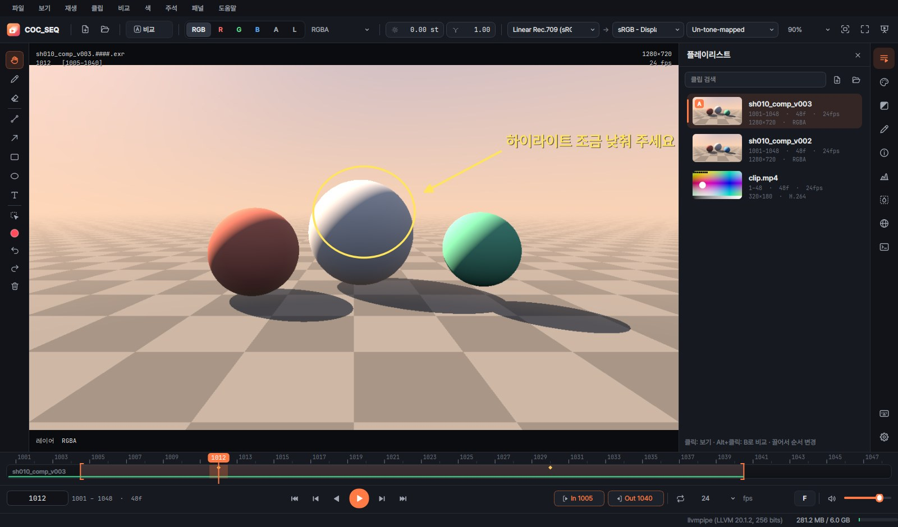
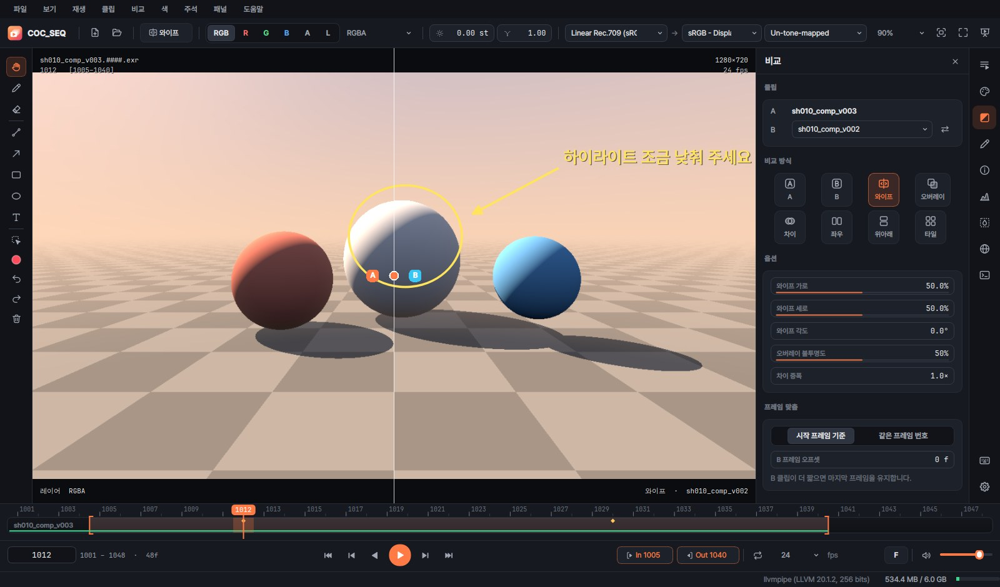

# COC_SEQ Player

이미지 시퀀스와 동영상을 재생하고 리뷰하는 **Windows용 플레이어**입니다.
[mrViewer (mrv2)](https://github.com/ggarra13/mrv2)의 기능을 바탕으로, 어두운 톤의 깔끔한 한국어 화면으로 새로 만들었습니다.



- EXR(멀티레이어/AOV) · DPX · TIFF · PNG · JPG · TGA · HDR · PSD 시퀀스, MOV · MP4 · MXF · MKV 동영상과 소리
- OpenColorIO 색 관리 (ACES 2.0 내장 설정), 노출 · 감마 · 색 보정 · LUT
- A/B 비교 (와이프 · 오버레이 · 차이 · 좌우 · 위아래 · 타일), 주석과 노트, PDF 리포트
- 동영상/시퀀스 내보내기 (H.264 · H.265 · ProRes · PNG · EXR · DPX …)

---

## 1. 설치

### 방법 A — 빌드된 프로그램 받기 (권장)

1. 저장소의 **Actions** 탭 → **COC_SEQ Player (Windows build)** → 가장 최근의 초록색(성공) 실행을 엽니다.
2. 아래쪽 **Artifacts**의 `COC_SEQ_Player_win64`를 내려받습니다(GitHub 로그인 필요).
3. 받은 zip 파일을 원하는 폴더(예: `C:\Tools\COC_SEQ Player`)에 압축 풉니다.
4. 그 안의 **`COC_SEQ Player.exe`** 를 실행합니다. 설치 과정은 없습니다.

- exe 옆의 `_internal` 폴더가 꼭 같이 있어야 합니다. 옮길 때는 폴더째로 옮기세요.
- 처음 실행할 때 "Windows의 PC 보호" 창이 뜨면 **추가 정보 → 실행**을 누르세요. 서명되지 않은 프로그램이라 나오는 안내입니다.

### 방법 B — 직접 빌드

1. [python.org](https://www.python.org/downloads/)에서 Python 3.12 (64비트)를 설치합니다. 설치할 때 "Add python.exe to PATH"를 켜세요.
2. `seq-player` 폴더의 **`build_exe.bat`** 을 더블클릭합니다.
3. 끝나면 `seq-player\dist\COC_SEQ Player\COC_SEQ Player.exe`가 만들어집니다. 마지막에 자체 점검 결과가 `RESULT: OK`인지 확인하세요.

### 개발용으로 소스에서 실행

```bash
cd seq-player
pip install -r requirements.txt
python run.py                 # 파일 경로를 뒤에 붙이면 바로 엽니다
python -m pytest tests        # 테스트
```

## 2. 파일 열기

- **끌어다 놓기**: 파일이나 폴더를 창에 끌어다 놓습니다. 여러 개를 한 번에 놓아도 됩니다.
- **파일 열기 `Ctrl+O`**: 시퀀스의 아무 프레임이나 하나 고르면 같은 이름의 프레임 전체를 시퀀스로 엽니다.
  - `shot_v002.1001.exr`, `render_0001.png`, `img_1.jpg`처럼 파일 이름 끝에 프레임 번호가 있으면 됩니다.
  - 빠진 프레임은 타임라인에 빨간 표시가 생기고, 화면에 "누락된 프레임"이 나옵니다.
  - 한 장만 따로 보려면 환경 설정 → 일반에서 시퀀스 자동 인식을 끄세요.
- **폴더 열기 `Ctrl+Shift+O`**: 폴더 안의 시퀀스, 동영상, 소리 파일을 모두 찾아 엽니다.
- **소리 연결**: 시퀀스에 wav/mp3를 붙이려면 파일과 함께 끌어다 놓거나 **파일 → 오디오 파일 연결…** 을 씁니다.
- **실행할 때 열기**: `COC_SEQ Player.exe 경로...` 또는 탐색기에서 파일을 exe 아이콘에 끌어다 놓습니다. 이미 창이 열려 있으면 그 창에서 엽니다.
- `F5`는 디스크를 다시 읽습니다. 렌더가 진행 중일 때 새로 생긴 프레임을 가져올 때 씁니다.

## 3. 화면 구성

| 위치 | 내용 |
|---|---|
| 위쪽 막대 | 파일 열기, 비교 방식, 채널(RGB/R/G/B/A/L), EXR 레이어, 노출·감마, 입력 색공간 → 디스플레이/뷰, 확대 비율 |
| 가운데 | 뷰어. 왼쪽에 주석 도구 막대가 떠 있습니다 |
| 오른쪽 | 패널(플레이리스트, 색 보정, 비교, 주석, 미디어 정보, 스코프, 영역 색 정보, 환경 맵, 로그)과 아이콘 줄 |
| 아래쪽 | 타임라인(캐시 상태 · 누락 프레임 · 주석 표시 · 소리 파형)과 재생 컨트롤 |
| 맨 아래 | 커서 아래 픽셀 값, OpenGL 정보, 캐시 메모리 사용량 |

- 노출·감마 칸은 **좌우로 드래그**해서 바꾸고, **더블클릭**하면 숫자를 입력하고, **우클릭**하면 기본값으로 돌아갑니다.
- 뷰어에서 **휠**은 확대/축소, **가운데 버튼 드래그**나 **Alt + 드래그**는 이동, **더블클릭**은 화면 맞춤, **Ctrl + 드래그**는 프레임 넘기기, **우클릭**은 메뉴입니다.
- 타임라인에 마우스를 올리면 그 프레임의 미리보기가 뜹니다. **Ctrl + 휠**은 타임라인 확대, **Shift + 휠**은 좌우 이동입니다.

## 4. 재생

- `Space` 재생/정지, `↑` 앞으로 재생, `↓` 거꾸로 재생, `← →` 한 프레임, `Shift + ← →` 10프레임, `Home` / `End` 처음/끝
- `J` `K` `L`도 씁니다 (거꾸로 / 정지 / 앞으로).
- **In/Out 구간**: `I`로 시작점, `O`로 끝점을 정합니다. 재생 · 반복 · 내보내기가 그 구간 안에서만 됩니다. `Shift+I`/`Shift+O`로 지우고, 재생 막대의 In/Out 단추를 우클릭해도 지워집니다.
- **반복 방식** `Ctrl+L`: 반복 → 한 번 → 왕복
- **재생 방식** (재생 메뉴):
  - **모든 프레임 재생**(기본값)은 디스크가 느려도 프레임을 건너뛰지 않습니다. 대신 속도가 떨어질 수 있고, 그러면 실제 FPS가 노란색으로 표시됩니다.
  - **실시간 유지**는 속도를 지키고 준비되지 않은 프레임을 건너뜁니다.
  - 소리가 있는 영상을 원래 FPS로 재생하면 소리에 맞춰 재생합니다.
- **FPS**: 재생 막대의 FPS 칸에서 고르거나 직접 입력합니다.
- **캐시**: 재생 위치 앞쪽 프레임을 미리 메모리에 읽어 둡니다. 읽어 둔 구간은 타임라인 아래에 초록 선으로 보입니다. 메모리 한도는 환경 설정 → 캐시·성능에서 바꿉니다.
- **플레이리스트**: `Page Down`/`Page Up`으로 클립을 오갑니다. "플레이리스트 이어서 재생"을 켜면 다음 클립으로 이어서 재생합니다.
- **버전 전환**: 경로에 `v001` 같은 버전이 있으면 `Ctrl+Page Up`/`Ctrl+Page Down`으로 같은 프레임의 다음/이전 버전을 엽니다.

## 5. 색 관리

- 입력 색공간은 파일 종류에 따라 자동으로 정해집니다. 실수 EXR은 `Linear Rec.709 (sRGB)`, 8/16비트 이미지와 동영상은 `sRGB Encoded Rec.709 (sRGB)`입니다. 기본값은 환경 설정 → 컬러 관리에서 바꿉니다.
- 위쪽 막대 또는 **색 보정 패널**에서 클립마다 입력 색공간을 바꾸고, 디스플레이 · 뷰 · 룩을 고릅니다.
  - 뷰 `Un-tone-mapped`는 톤매핑 없이 봅니다.
  - `ACES 2.0 - SDR 100 nits (Rec.709)`는 ACES 톤매핑으로 봅니다.
- OCIO 설정은 내장 **ACES Studio**가 기본입니다. 회사 `.ocio` 파일을 쓰거나, `OCIO` 환경 변수를 따르게 할 수도 있습니다.
- **LUT 파일**(.cube, .3dl, .csp, .spi3d, .clf …)은 OCIO 결과 뒤에 붙이거나, OCIO 대신 쓸 수 있습니다.
- **노출**은 스톱 단위입니다(`[` `]`로 ½스톱씩, `\` 초기화). 감마는 `{` `}`로 바꿉니다.
- **색 보정**: 더하기, 대비, 채도, 색조 회전, 소프트 클립, 반전, 레벨(입력·출력 최소/최대, 감마)
- **알파**: 무시 / Straight / Premultiplied로 합성합니다. 배경은 어두운 회색 · 검정 · 회색 · 체커보드 · 사용자 색 중에서 고릅니다.
- **채널**: `C` 컬러, `R` `G` `B` `A`, `Y` 휘도. 같은 키를 다시 누르면 컬러로 돌아갑니다. EXR 레이어는 `Ctrl+[` / `Ctrl+]`로 바꿉니다.

## 6. 비교 (A/B)



- 플레이리스트에서 **Alt+클릭**하거나 우클릭 → "B로 비교"를 고르면 그 클립이 B가 되고 와이프 모드로 바뀝니다.
- 위쪽 막대의 **비교** 단추, 비교 패널, 또는 단축키로 모드를 바꿉니다.
  - 와이프 `W`: 드래그하면 위치가, Shift+드래그하면 각도가 바뀝니다.
  - 오버레이: 불투명도를 조절합니다.
  - 차이: 증폭 값을 조절합니다.
  - 좌우, 위아래
  - 타일: 클립 4개까지 보여 줍니다.
- 프레임은 두 클립의 시작 프레임끼리 맞춥니다. 비교 패널에서 같은 프레임 번호 기준으로 바꾸거나 오프셋을 줄 수 있습니다.

## 7. 주석과 노트

- 왼쪽 도구 막대나 주석 패널에서 도구를 고릅니다: 펜 `P`, 지우개 `E`, 직선, 화살표, 사각형, 원, 텍스트 `T`
  - 도형은 Shift를 누르고 그리면 정사각형/정원이 되고, 선은 45° 단위로 맞춰집니다.
- 색, 굵기, 채우기, **유지**(몇 프레임 동안 보일지), **고스트**(앞뒤 프레임 주석을 흐리게 보기)를 정할 수 있습니다.
- 주석 패널의 **프레임 노트**에 글로 메모를 남깁니다.
- 주석이 있는 프레임은 타임라인에 노란 마름모로 표시됩니다. `Ctrl+←` / `Ctrl+→`로 이동합니다.
- **PDF로 내보내기**: 주석이 있는 프레임마다 한 쪽씩, 그림과 노트를 담은 리뷰 리포트를 만듭니다.
- 주석은 **세션 파일**에 함께 저장됩니다.

## 8. 저장과 내보내기

- **세션** `Ctrl+S`: 열린 클립, In/Out, 레이어, 색 설정, 비교 설정, 주석을 `.cocseq` 파일로 저장합니다. 세션 파일을 끌어다 놓으면 그대로 다시 열립니다.
- **현재 프레임 저장** `Ctrl+Shift+S`: PNG/JPG/TIFF/EXR로 저장합니다. 주석을 넣을지 고를 수 있습니다.
- **내보내기** `Ctrl+E`:
  - 이미지 시퀀스: PNG 8/16비트, JPEG, TIFF 8/16비트, OpenEXR, DPX 10비트
  - 동영상: MP4 H.264, MP4 H.265, MOV ProRes 422 HQ, MOV ProRes 4444(알파), MOV Motion JPEG
  - 범위(In–Out/전체/현재 프레임/직접 입력), 크기(100/75/50/25%), 품질, FPS, 시작 번호를 고릅니다. 뷰어 색 보정, 주석, 소리를 넣을 수 있습니다.
  - EXR은 색 보정을 끄면 원본 값 그대로(레이어 포함) 내보냅니다.

## 9. 그 밖의 기능

- **스코프**: 히스토그램(로그 스케일), 웨이브폼(휘도/RGB 퍼레이드), 벡터스코프
- **미디어 정보**: 해상도, 데이터/디스플레이 윈도우, 채널, 레이어, 압축, 코덱, 타임코드, 전체 메타데이터(검색 · 복사)
- **영역 색 정보**: 영역 선택 도구 `Shift+M`로 드래그하면 영역의 최소·최대·평균 값(원본/화면)을 보여 줍니다.
- **보기**:
  - 좌우/상하 뒤집기, 90° 회전
  - 안전 영역, 화면비 가이드(1.85, 2.39 …), 데이터/디스플레이 윈도우 표시
  - HUD `Ctrl+H`, 부드럽게 확대(선형) 또는 픽셀 그대로
- **360° 파노라마**: 환경 맵 패널에서 구면(Lat-Long) 이미지를 드래그해 둘러봅니다.
- **전체 화면** `F11`, **프레젠테이션 모드** `F12` (모든 막대를 숨김, `Esc`로 나가기), 항상 위에 표시
- **단축키 편집** `F1`: 모든 단축키를 바꿀 수 있고, 겹치는 키를 알려 줍니다.
- **환경 설정** `Ctrl+,`: 강조 색, 캐시 메모리, 읽기 스레드 수, 기본 FPS, 누락 프레임 처리, OCIO, 오디오 장치 등을 설정합니다.

## 10. 단축키 (기본값)

| 동작 | 키 | 동작 | 키 |
|---|---|---|---|
| 재생 / 정지 | `Space` | 화면 맞춤 | `F` |
| 앞으로 / 거꾸로 재생 | `↑` / `↓`, `L` / `J` | 100% · 200% · 50% | `1` · `2` · `0` |
| 정지 | `K` | 확대 / 축소 | `=` / `-` |
| 한 프레임 | `←` `→` | 가운데로 | `H` |
| 10프레임 | `Shift + ← →` | 전체 화면 / 프레젠테이션 | `F11` / `F12` |
| 처음 / 끝 | `Home` / `End` | 사이드 패널 | `Tab` |
| In / Out 지정 | `I` / `O` | 패널 바로 열기 | `Alt+1` ~ `Alt+7` |
| In / Out 지우기 | `Shift+I` / `Shift+O` | 채널 컬러 · R · G · B · A · 휘도 | `C` `R` `G` `B` `A` `Y` |
| 반복 방식 | `Ctrl+L` | 노출 ∓½ / 초기화 | `[` `]` / `\` |
| 다음 / 이전 클립 | `Page Down` / `Page Up` | 감마 | `{` `}` |
| 다음 / 이전 버전 | `Ctrl+Page Up` / `Ctrl+Page Down` | 와이프 | `W` |
| B로 지정 | `Ctrl+B` | 비교 A · B · 오버레이 · 차이 · 좌우 · 위아래 · 타일 | `Ctrl+1` ~ `Ctrl+7` |
| 파일 / 폴더 열기 | `Ctrl+O` / `Ctrl+Shift+O` | 펜 · 지우개 · 텍스트 | `P` · `E` · `T` |
| 세션 저장 | `Ctrl+S` | 화살표 · 사각형 · 원 · 직선 | `Shift+A` · `Shift+R` · `Shift+C` · `Shift+L` |
| 프레임 저장 | `Ctrl+Shift+S` | 주석 실행 취소 / 다시 | `Ctrl+Z` / `Ctrl+Shift+Z` |
| 내보내기 | `Ctrl+E` | 다음 / 이전 주석 프레임 | `Ctrl+→` / `Ctrl+←` |
| 디스크 새로고침 | `F5` | 단축키 편집 / 환경 설정 | `F1` / `Ctrl+,` |

## 11. 문제 해결

- **화면이 검거나 "OpenGL 3.3을 사용할 수 없습니다"가 나올 때**: 그래픽 드라이버를 업데이트하세요. 원격 데스크톱이나 가상 머신에서는 소프트웨어 렌더링을 쓰세요. 프로그램이 다시 시작하겠냐고 물어보며, 직접 켜려면 `COC_SEQ Player.exe --software-gl`로 실행합니다. 느리지만 대부분 동작합니다.
- **재생이 끊길 때**:
  - 환경 설정 → 캐시·성능에서 메모리 한도와 읽기 스레드 수를 늘리세요.
  - 네트워크 드라이브의 큰 EXR은 한 번 끝까지 재생해서 캐시에 올린 뒤 보면 부드럽습니다.
  - 속도를 유지하는 게 중요하면 재생 메뉴에서 "실시간 유지"로 바꾸세요.
- **소리가 안 날 때**: 환경 설정 → 오디오에서 출력 장치를 확인하세요. FPS를 원래 값에서 바꾸면 소리는 꺼집니다.
- **로그 위치**: `%LOCALAPPDATA%\COC\COC_SEQ_Player\logs\app.log` (오류가 나면 이 파일을 보내 주세요). 프로그램 안에서는 로그 패널에서 볼 수 있습니다.
- **빌드 점검**: `COC_SEQ Player.exe --self-test 결과.txt`를 실행하면 이미지·색·동영상·OpenGL 구성 요소를 점검해 파일로 남깁니다.
- **설정 초기화**: `%APPDATA%\COC\COC_SEQ_Player.ini`를 지우면 처음 상태로 돌아갑니다.

## 12. mrViewer와 비교

mrViewer(mrv2)의 뷰어 기능을 대부분 담았고, 스튜디오 파이프라인 전용 기능 몇 가지는 뺐습니다.

| 들어 있음 | 빠진 기능 |
|---|---|
| 시퀀스·동영상·소리 재생, 캐시, In/Out, 반복 방식, FPS | 스테레오 3D 보기 |
| EXR 레이어/파트, 데이터·디스플레이 윈도우, 픽셀 비율 | USD 재생 |
| OCIO(입력/디스플레이/뷰/룩), LUT, 노출·감마·색 보정·레벨 | 여러 컴퓨터 동기화 재생 (네트워크 싱크) |
| 채널·알파 보기, 배경, 필터, 뒤집기·회전 | Python 스크립트 · 플러그인 |
| A/B 비교 8가지, 버전 전환, 플레이리스트 | OTIO 타임라인 편집 (자르기·붙이기) |
| 주석·노트·고스트, PDF 리포트 | NDI · SDI 출력, 음성 주석 |
| 스코프, 미디어 정보, 픽셀/영역 색 정보, 로그 | 큐브맵 환경 맵 (구면만 지원) |
| 안전 영역, HUD, 프레젠테이션, 360° 파노라마 | |
| 세션, 내보내기, 단축키 편집, 환경 설정, 단일 창 실행 | |

## 13. 만든 방법과 라이선스

- **만든 도구**: Python과 Qt(PySide6)로 만들었고, OpenGL로 화면을 그립니다.
  - 이미지는 OpenImageIO, 동영상과 소리는 FFmpeg(PyAV)로 읽습니다.
  - 색 관리는 OpenColorIO, 소리 출력은 PortAudio를 씁니다.
- **글꼴**: Pretendard, JetBrains Mono (SIL Open Font License 1.1). `assets/fonts`에 라이선스가 들어 있습니다.
- **FFmpeg 라이선스**: PyAV에 들어 있는 FFmpeg에는 GPL인 libx264/libx265가 포함됩니다. 회사 안에서 쓰는 데는 문제가 없습니다. 프로그램을 밖으로 배포할 때는 GPL 조건을 확인하세요.
